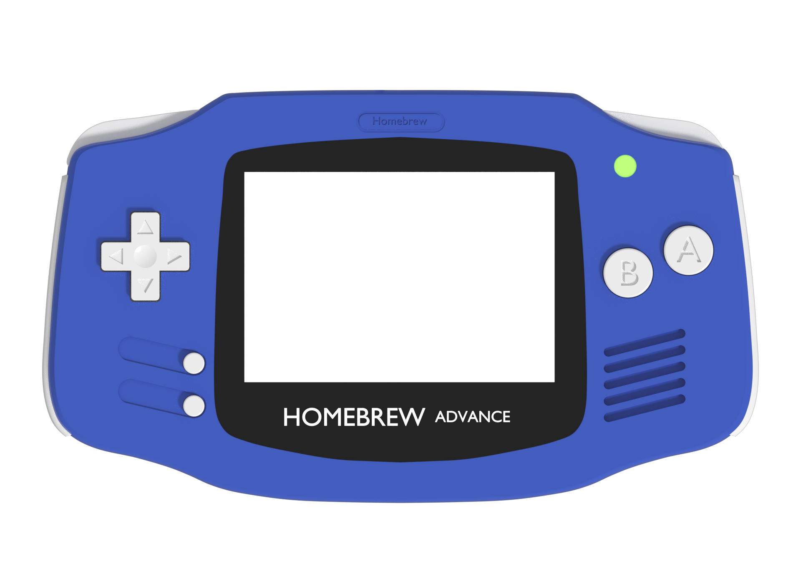
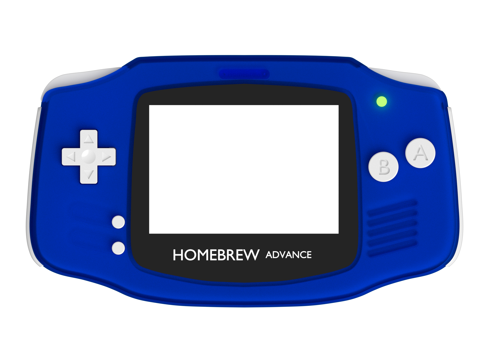
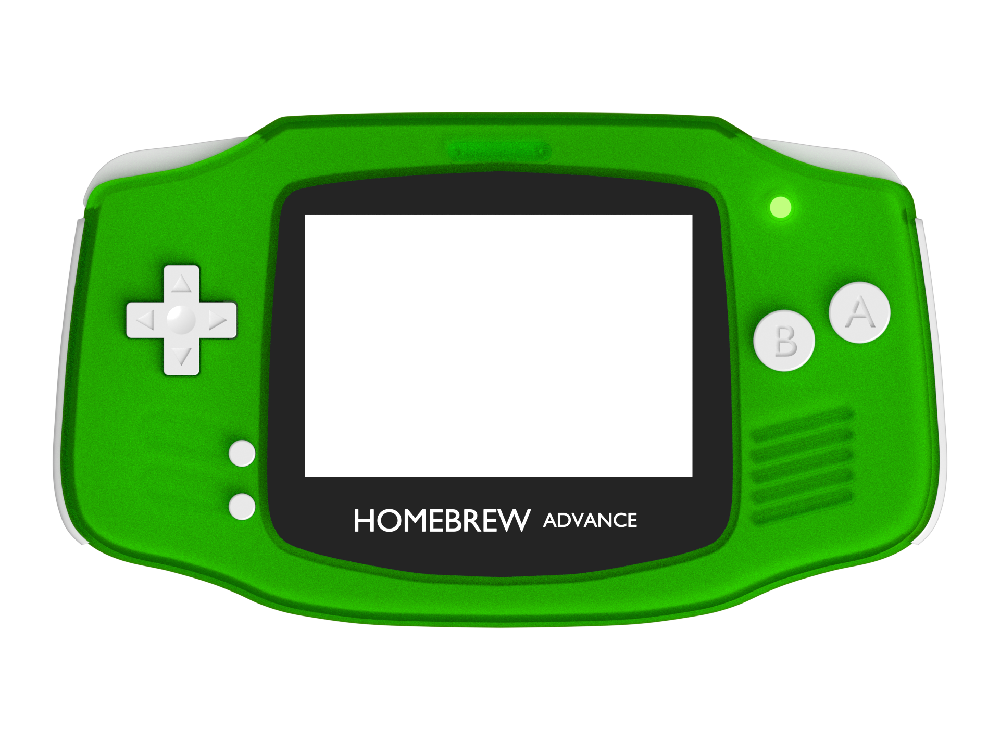
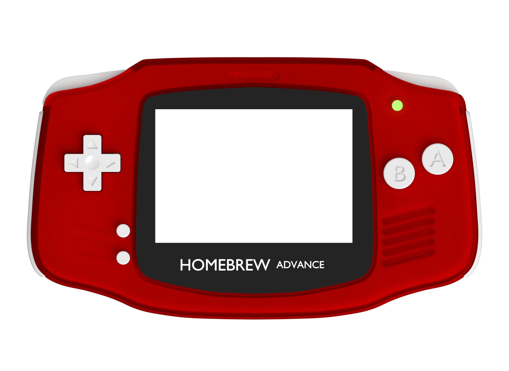
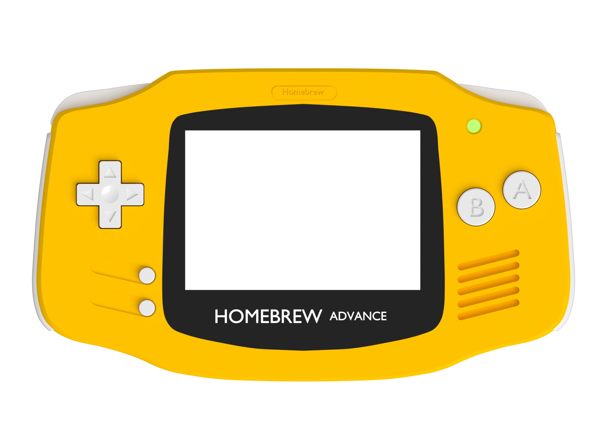

# Nintendo GameBoy Advance

It took Nintendo many years, to bring the world a new GameBoy. But the GameBoy Advance was brilliant. The first version didn't have a lit screen, the GameBoy Advance SP did. Games like Pokémon Sapphire and Ruby, Golden Sun, Secret of Mana and The Legend of Zelda - The Minish Cap showed the handy gaming consoles potential. Classics like The Legend of Zelda - A Link to the Past, Super Mario World and Metroid made their way to the handheld. It was Nintendo's first handheld to get a Mario Kart.

