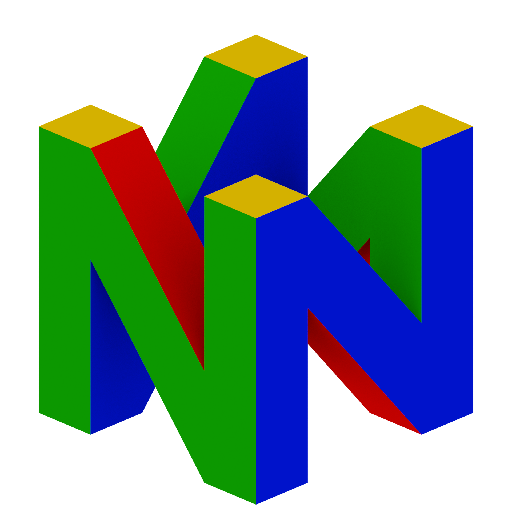
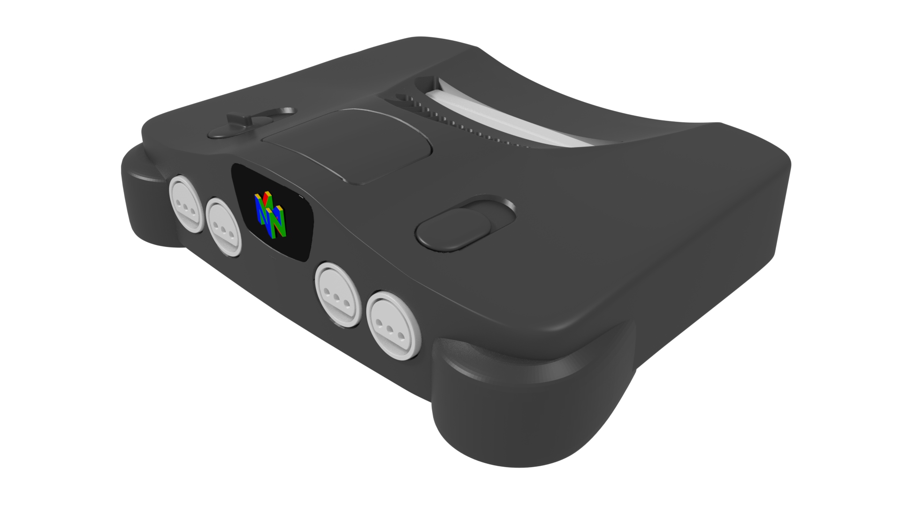

# Nintendo 64

The Nintendo 64 was Nintendo's first 3D gaming console and opened an era of great 3D games like Super Mario 64, The Legend of Zelda - Ocarina of Time, Super Smash Bros. and Mario Kart 64.

