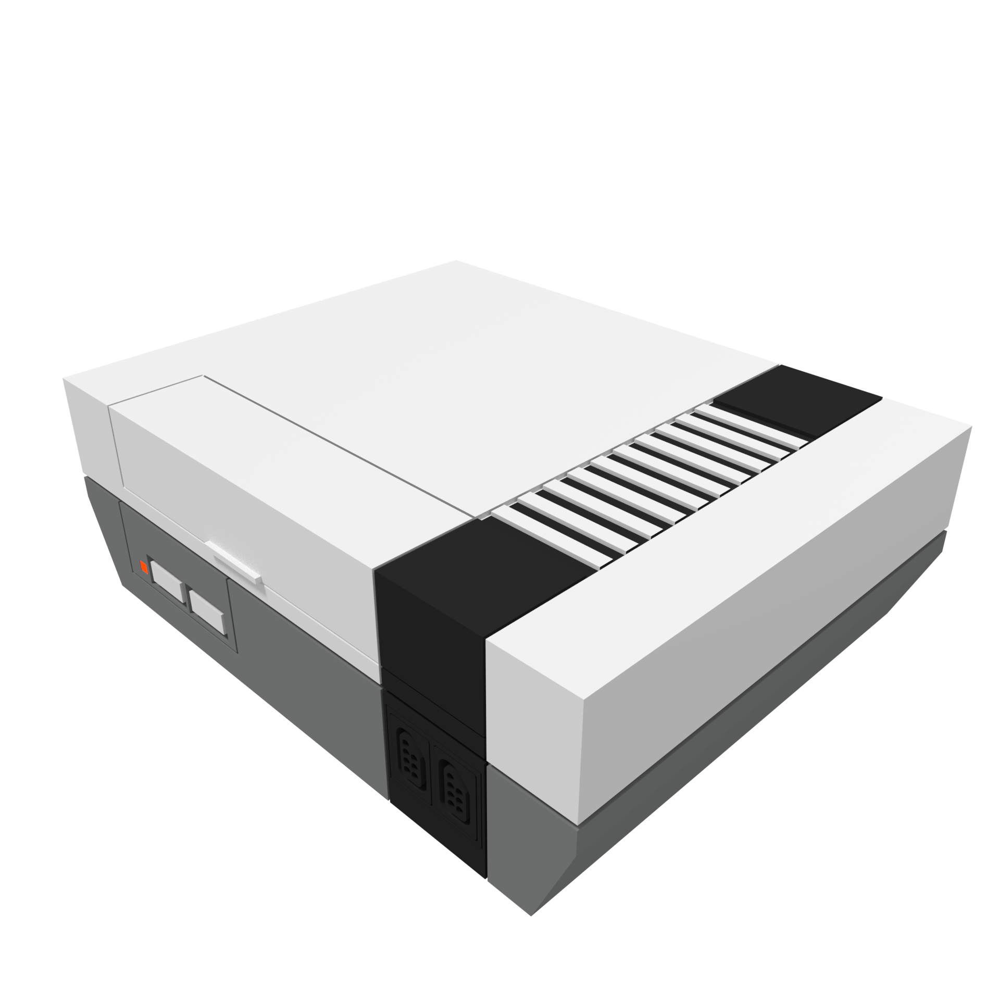
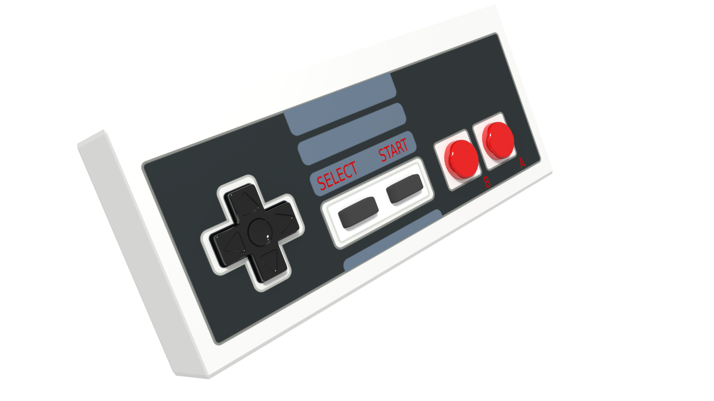

# Nintendo Entertainment System

The Nintendo Entertainment System was Nintendo's first stationary home console and marks the beginning of Nintendo's way to the world's most loved video game factory.

