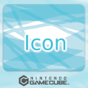
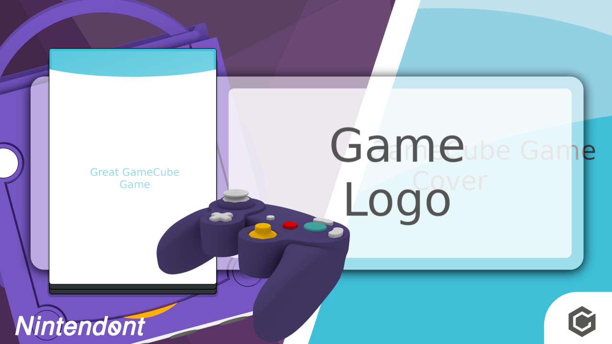

# Wii U Banner and Icon Template for GameCube games

Simply replace the included generic example images with proper game media. Open the template in Inkscape and export banner and icon.

## Media

Put the following images into the same directory:

* **Game Logo:** 400x250 pixels ´logo.png´
* **Gamepad from top:** 1920x1080 pixels ´gc_pad_t.png´
* **Gamepad perspective:** 1920x1080 pixels ´gc_gamepad_p.png´
* **Background:** 1280x1280 pixels ´background.png´
* **Game Cover:** 1000x1400 pixels ´cover.png´
* **Icon:** 512x512 pixels ´icon.png´

## Examples

It will look like this

