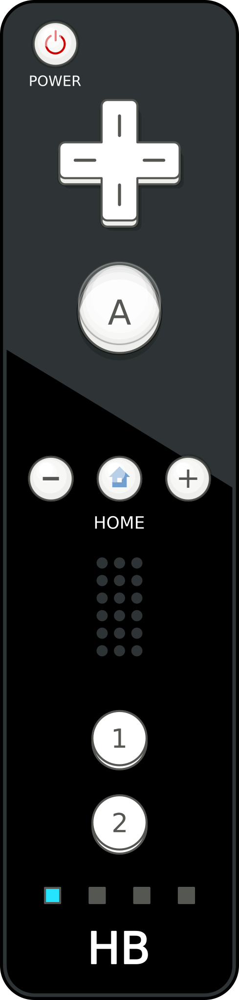
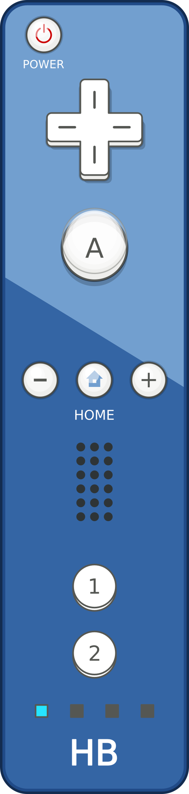
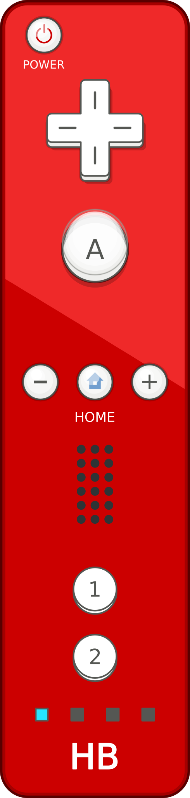
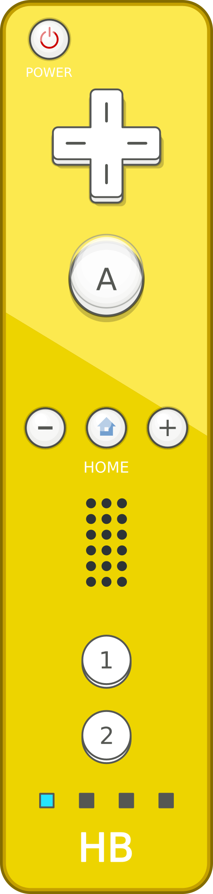
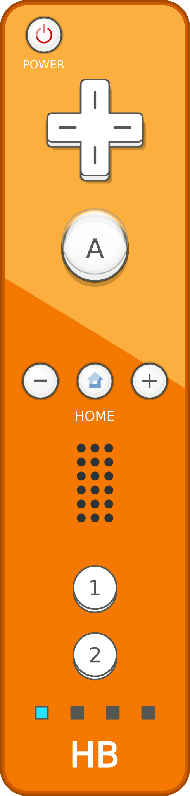
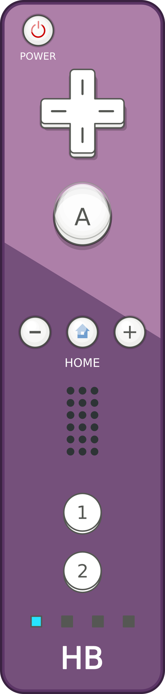
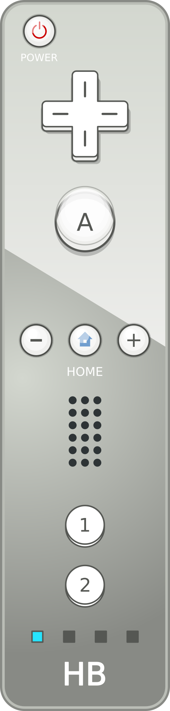

# Nintendo Wii

With the Nintendo Wii the japanese company did a very brave leap forward and introduced a new innovative gamepad concept - the Wiimote. A gaming controller with gyro sensors and infrared camera and split into a remote like gamepad and the Nunchuck. It changed the way what people thought was typical for playing video games forever. For many The Legend of Zelda - The Wind Waker marks the peak of all Zelda games, both Super Mario Galaxy games are still on the first two ranks of all games ever made on GameRankings.com and Mario Kart Wii had players all around the world play together. The Wii although had the biggest homewbrew community, known to a wider, even nin-technical audience.

