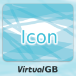
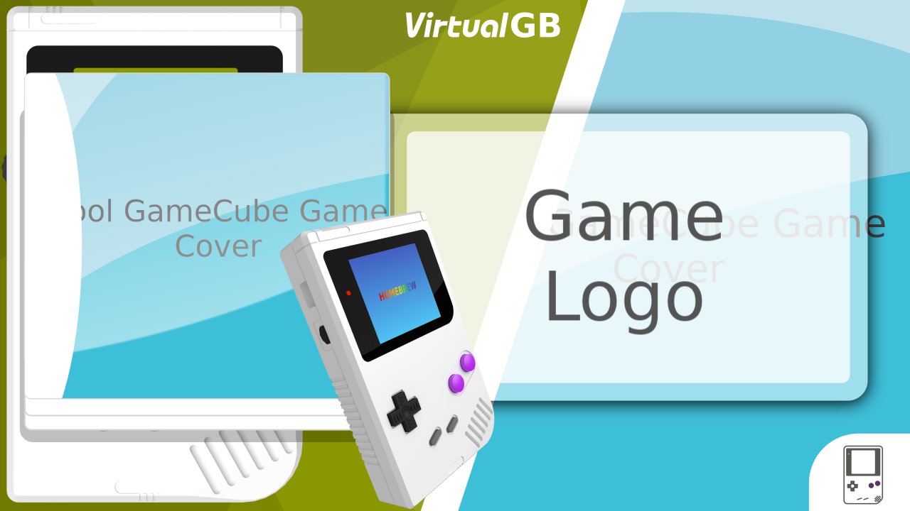

# Wii U Banner and Icon Template for GBA games

Simply replace the included generic example images with proper game media. Open the template in Inkscape and export banner and icon.

Put the screenshot inside with GIMP: Tools > Transform Tools > Perspective.
Simply move the corners of your screenshot to the corners of the example image and overwrite.

Then export with Inkscape as usual.

## Media

Put the following images into the same directory:

* **Game Logo:** 400x250 pixels `logo.png`
* **GBA from top:** 1920x1920 pixels `gba_t.png`
* **GBA from top left:** 1920x1100 pixels `gba_p.png`
* **Background:** 1280x1280 pixels `background.png`
* **Game Cover:** 2048x1831 pixels `cover.png`
* **Icon:** 512x512 pixels `icon.png`
* **Screenshot:** 1920x1400 pixels `screenshot.png`

You can find more Nintendo colors in `GameBoy_Advance/`

## Examples

It will look like this

