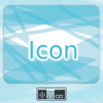
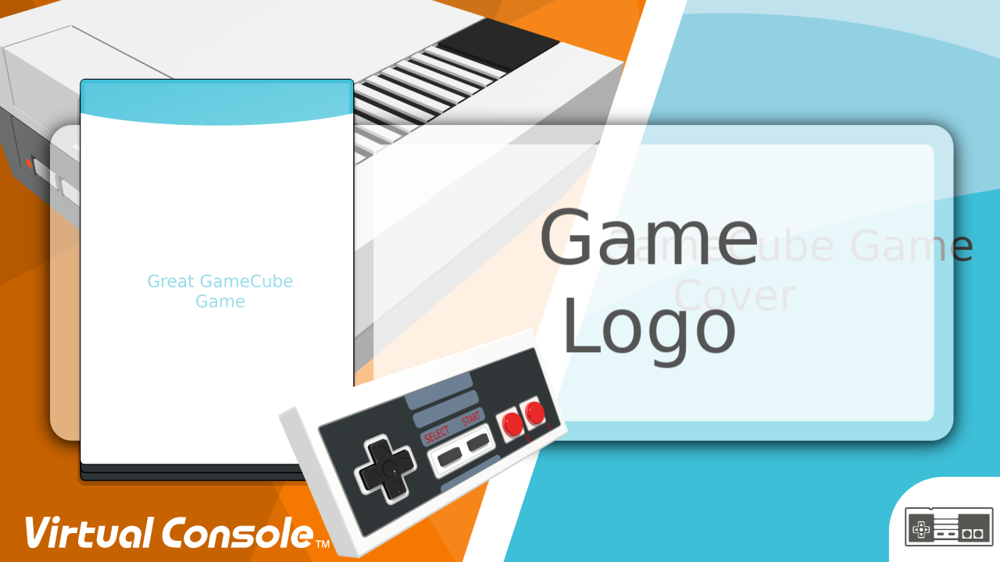

# Wii U Banner and Icon Template for NES games

Simply replace the included generic example images with proper game media. Open the template in Inkscape and export banner and icon.

## Media

Put the following images into the same directory:

* **Game Logo:** 400x250 pixels `logo.png`
* **Gamepad from top left:** 1920x1080 pixels `NES_GamePad_pers_left.png`
* **NES Gaming Console:** 1920x1920 pixels `NES_Console_perspective.png`
* **Background:** 1280x1280 pixels `background.png`
* **Game Cover:** 1000x1400 pixels `cover.png`
* **Icon:** 512x512 pixels `icon.png`

You can find more NES gamepad renderings in `Nintendo/Nintendo_Entertainment_System/GamePad/`

## Examples

It will look like this

