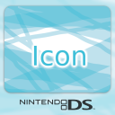

# Wii U Banner and Icon Template for NintendoDS games

Simply replace the included generic example images with proper game media. Open the template in Inkscape and export banner and icon.

## Media

Put the following images into the same directory:

* **Game Logo:** 400x250 pixels `logo.png`
* **NintendoDS from top:** 1920x1080 pixels `gc_pad_t.png`
* **Background:** 1280x1280 pixels `background.png`
* **Game Cover:** 2048x2048 pixels `cover.png`
* **Icon:** 512x512 pixels `icon.png`

You can find more Nintendo colors in `Nintendo/NintendoDS/`

## Examples

It will look like this

