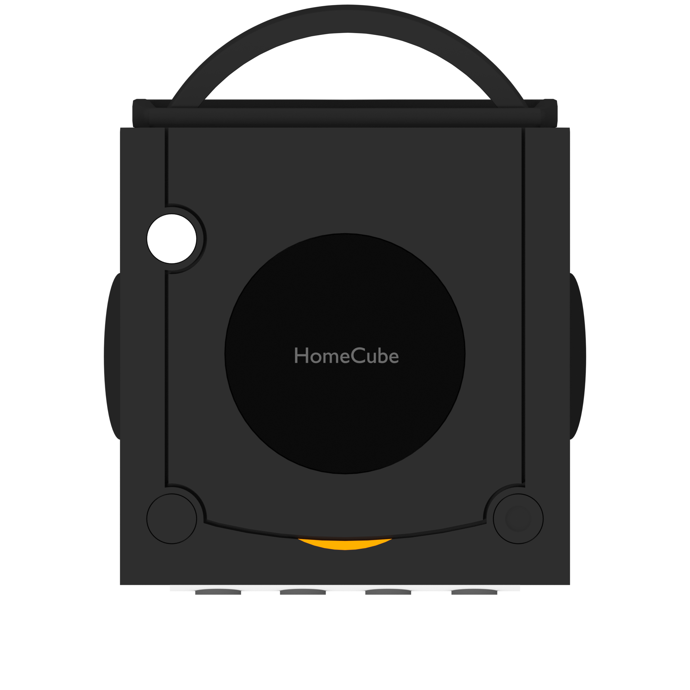
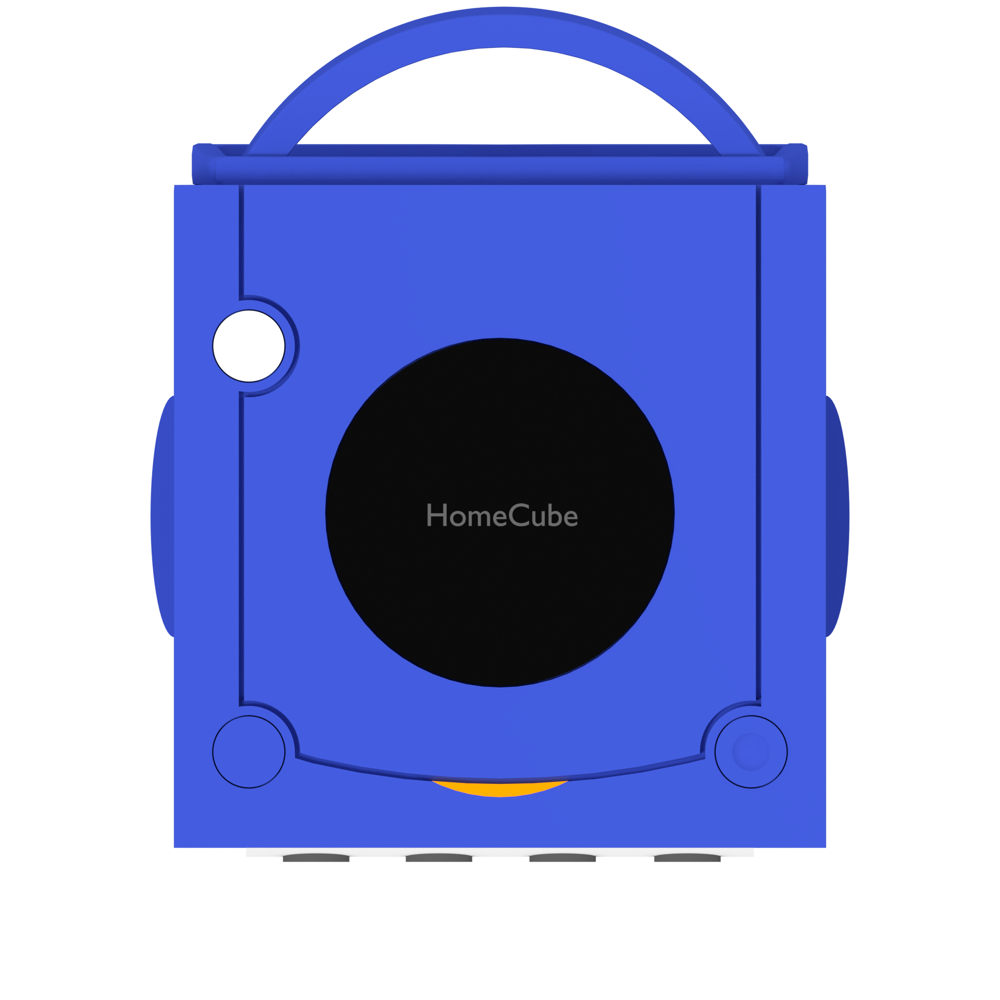
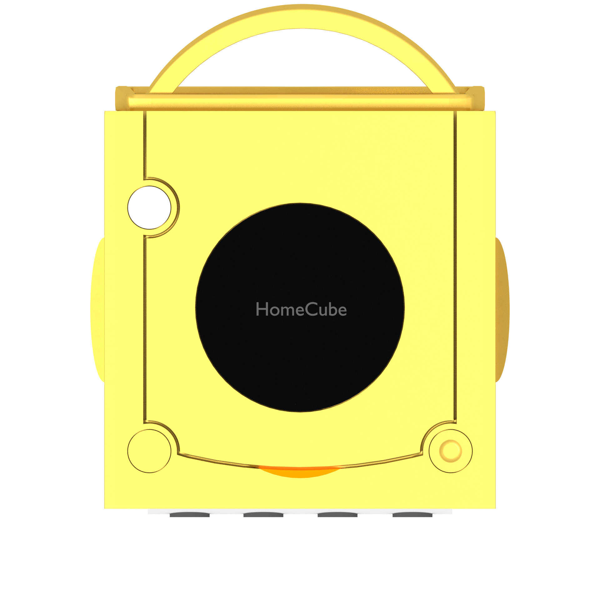
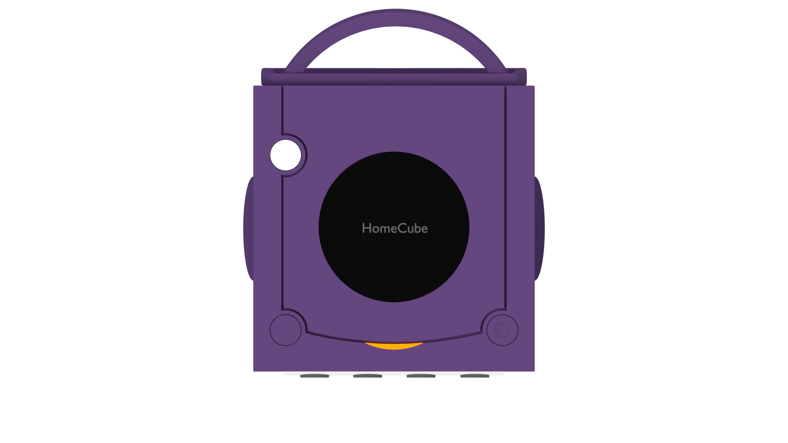
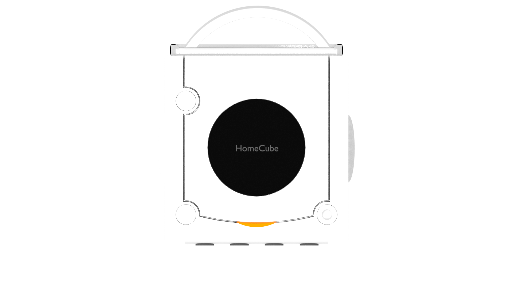

# Open videogame console graphics

A collection of open source video game console graphics like gamepad vector graphics and 3d models.

## Use requirements

Only for private use. Use only, if you own the respective games and consoles. I do not support piracy. If you want a game, buy it! Only this way you appreciate and support the development of great games. Piracy leads to stupid, short, advertisement infested games, no one should play.
